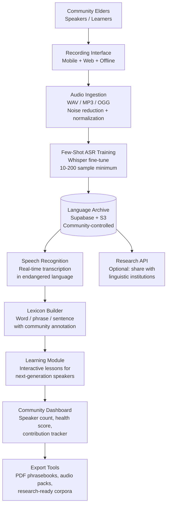

<p align="center">
  <h1 align="center">foundation-living-tongue</h1>
  <h3 align="center"><em>Indigenous language preservation. Few-shot speech AI. A language dies every 2 weeks.</em></h3>
</p>

<p align="center">
  <a href="LICENSE"></a>
  
  
  <a href="https://mama.oliwoods.ai"></a>
  <a href="https://mama.oliwoods.ai/foundation"></a>
</p>

---

> *"A language dies every two weeks. When it goes, it takes a unique way of understanding time, kinship, ecology, and the human condition — knowledge that cannot be recovered."*
> — UNESCO Atlas of the World's Languages in Danger

## Why This Exists

Language extinction is not inevitable. It is the result of colonization, marginalization, and — until now — the absence of technology designed for communities with small speaker populations. Standard speech AI requires thousands of hours of training data. Endangered languages have minutes.

- **40% of the world's ~7,000 languages** are at risk of disappearing (UNESCO, 2023)
- **A language dies every 14 days** — at this rate, 90% of existing languages will be gone by 2100 (UNESCO)
- **Less than 4%** of the world's languages have any digital presence whatsoever (Endangered Languages Project, Google)
- **Few-shot AI** — models that learn from 10-50 samples rather than 10,000 hours — is the only viable technical path for most endangered languages

This project does not just archive languages. It helps communities actively speak them.

## System Architecture



## Features

| Feature | Description | Approach |
|---------|-------------|----------|
| **Few-Shot ASR** | Speech recognition trained from as few as 10-200 audio samples | Whisper + LoRA fine-tune |
| **Community Recording Studio** | Mobile-first interface for elders to record words, phrases, stories | Offline-capable |
| **Lexicon Builder** | Community-annotated word database with audio, IPA, context, and cultural notes | Community-owned |
| **Interlinear Text** | Side-by-side indigenous text + phonetic transcription + translation | Linguist-standard format |
| **Next-Gen Learning** | Interactive lessons built from community recordings; designed for children | Game-based + audio |
| **Language Health Score** | Speaker population tracking, age distribution, vitality assessment | UNESCO EGIDS scale |
| **Export + Archive** | Research-ready corpora, PDF phrasebooks, offline audio packs | ELAR / AILLA compatible |
| **Community Sovereignty** | All data is owned and controlled by the speaker community, not the platform | Self-hosted option |

## Research Foundation

| Citation | Finding | Relevance |
|----------|---------|-----------|
| UNESCO (2023) | 3,000+ languages endangered; acceleration linked to urbanization + cultural pressure | Scale of urgency |
| Baevski et al. / Meta AI (2022) | wav2vec 2.0 enables ASR with < 10 minutes of labeled speech | Few-shot architecture |
| Mager et al. (2023) | Indigenous NLP requires community co-design, not extraction | Community sovereignty model |
| Ethnologue (2023) | Only 23 languages have >50M speakers; 6,500+ have fewer than 1M | Long-tail focus |

## Quick Start

```bash
git clone https://github.com/OliWoods-Org/foundation-living-tongue.git
cd foundation-living-tongue
npm install
npm run dev
```

## Tech Stack

- **Runtime:** Node.js + TypeScript
- **Speech AI:** OpenAI Whisper (few-shot fine-tuning via LoRA)
- **Database:** Supabase (PostgreSQL + Storage)
- **AI:** Claude API (NLP, annotation assistance)
- **Offline:** Service Workers + IndexedDB
- **Export:** PDF generation, ELAR-compatible archive format

## Contributing

We actively seek contributions from indigenous community members, field linguists, computational linguists, and anyone with experience in language documentation. Data sovereignty is a core principle — no language data enters this system without explicit community consent.

1. Fork the repo
2. Create a feature branch (`git checkout -b feat/amazing-feature`)
3. Commit your changes
4. Push and open a PR

## License

AGPL-3.0 — Free to use, modify, and distribute.

---

<p align="center">
  <strong>Built by the <a href="https://oliwoods.ai">OliWoods Foundation</a></strong><br>
  <em>Free forever. Open source. Because every language that dies takes a world with it.</em>
</p>
